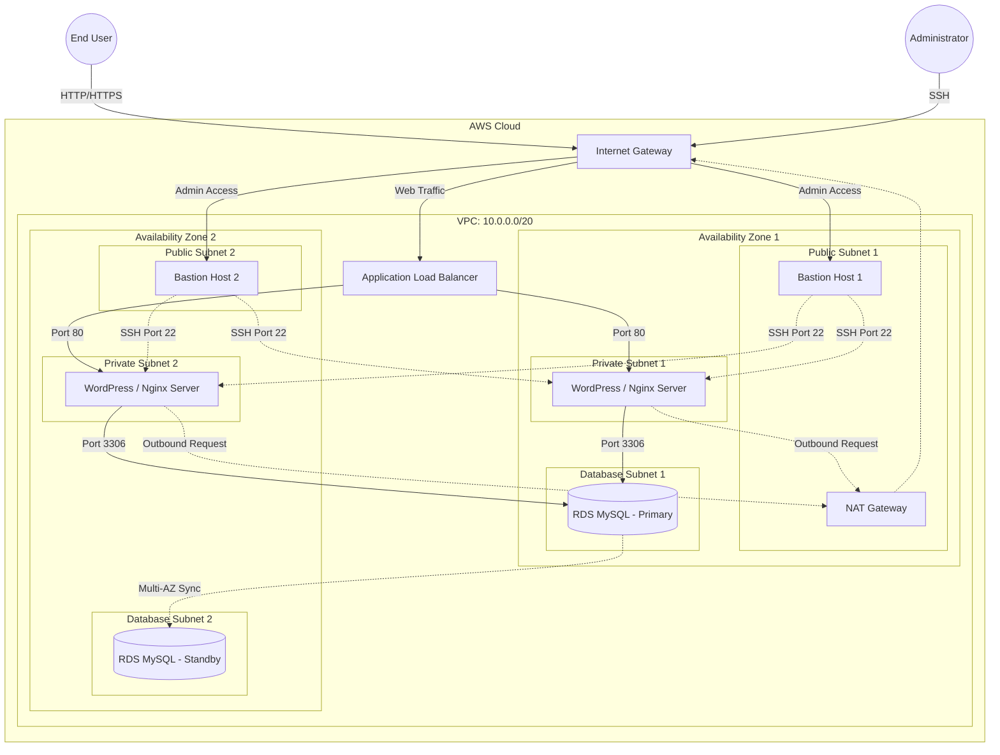

# ShopVibe E-Commerce Cloud Infrastructure Modernization

## 📌 Project Overview
This repository contains the Infrastructure as Code (CloudFormation) template for the **ShopVibe Holiday Flash Sale** modernization project[cite: 2]. 

The previous environment depended on a single server, which created risks such as downtime, performance bottlenecks, and manual operational processes during high-volume sales events[cite: 2]. This modern infrastructure design improves application availability, strengthens security, automates deployment, and supports dynamic growth during traffic spikes[cite: 2].

## 🏗️ Architecture Diagram

The architecture is built on AWS and features a highly available, Multi-AZ deployment. The network is divided into public subnets (for edge routing and administrative access), private subnets (for the application layer), and isolated database subnets (for data persistence).

## ✨ Key Features & Expected Outcomes

### 1. High Availability & Scalability
* **Dynamic Workload Scaling:** Additional servers are automatically created when demand increases, ensuring consistent application performance during peak business periods[cite: 2].
* **Automated Recovery:** Failed servers are automatically replaced without manual intervention[cite: 2].
* **Multi-AZ Database:** Amazon RDS MySQL is deployed across multiple isolated locations to eliminate single points of failure[cite: 2].

### 2. Automation
* **Zero-Touch Provisioning:** Every new replacement server automatically initializes, deploys the latest application version (Nginx, PHP-FPM, WordPress), and begins serving users without manual intervention[cite: 2].

### 3. Security & Network Design
* **Isolated Production Environment:** Production systems remain inaccessible from the public internet[cite: 2].
* **Secure Administrative Access:** Administrative resources (Bastion Hosts) communicate securely with internal systems[cite: 2]. Only authorized personnel are permitted to manage internal resources[cite: 2].

## 🚀 Deployment Instructions

### Prerequisites
* An active AWS Account.
* An existing EC2 Key Pair to use for Bastion Host SSH access.

### Steps to Deploy
1. Log in to the [AWS Management Console](https://aws.amazon.com/console/).
2. Navigate to the **CloudFormation** service.
3. Click **Create stack** (With new resources (standard)).
4. Select **Upload a template file**, choose `project_cloud_formation_template.yaml` from this repository, and click **Next**.
5. Provide a **Stack name** (e.g., `shopvibe-infrastructure`).
6. Fill in the required parameters:
   * **KeyName:** Select your existing EC2 Key Pair.
   * **DBUser:** Choose a database administrator username (minimum 4 characters).
   * **DBPassword:** Set a secure password for the database (minimum 8 characters).
7. Click **Next** through the configuration options, leave defaults, and click **Submit**.
8. Wait approximately 10-15 minutes for AWS to provision the VPC, subnets, NAT Gateways, Load Balancer, EC2 instances, and the RDS database.
9. Once the stack status is `CREATE_COMPLETE`, navigate to the **Outputs** tab to find your `PlatformURL` (Load Balancer DNS) and your `BastionPrimaryIP` for SSH access.

## 🛠️ Technology Stack
* **AWS CloudFormation** (Infrastructure as Code)
* **Amazon VPC** (Networking & Security Groups)
* **Elastic Load Balancing (ALB)** (Traffic Distribution)
* **Amazon EC2 Auto Scaling** (Dynamic Compute)
* **Amazon RDS** (Managed MySQL Database)
* **Nginx & PHP-FPM** (Web Server Engine)
* **WordPress** (Content Management System)
